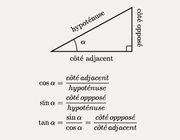

# 7. Modules

Lorsqu'on crée de multiples programmes dans des domaines similaires, il est fort probable que des parties de code puissent être réutilisées très fréquemment. Il serait donc plus efficace de placer ce code d'utilité générale dans un endroit spécifique.

Un **module** est un ou plusieurs fichiers en Python que l'on peut importer au début d'un programme.
Ce sont des scripts, contenant un ensemble de définitions — typiquement des fonctions, mais aussi des variables ou constantes (comme *pi* du module `math`).

Python est accompagné d'une bibliothèque de modules standards, tels que :

- `math`,
- `random`,
- `time`,
- `turtle`.

Pour d'autres modules, on peut consulter l'[index des modules Python](https://docs.python.org/3/py-modindex.html).

## Importer un module

Le mot-clé `import` permet d'importer un module. La fonction `dir` permet de voir le contenu du module.
Normalement tous les modules sont importés au début d'un programme.

```{codeplay}
import math

print(dir(math))
````

**Exercice :** importez le module `random` et affichez son contenu avec `dir`.

Pour utiliser une fonction du module importé, il faut faire précéder le nom de la fonction par le nom du module, séparé d'un point.

```{codeplay}
import math


print('e =', math.e)
print('pi =', math.pi)
print('fact(7) =', math.factorial(7))
````

**Exercice :** utilisez la fonction `pow` (puissance) et affichez le résultat.

## Module `math`

On retrouve dans le module `math` des fonctions ainsi que des constantes :

- arithmétiques,
- logarithmiques et exponentielles,
- trigonométriques.

Voici quelques utilisations du module `math` avec des fonctions trigonométriques.



```{codeplay}
from math import asin, acos, atan, degrees

opp = 3
adj = 4
hyp = 5

print(degrees(asin(opp/hyp)))
print(degrees(acos(adj/hyp)))
print(degrees(atan(opp/adj)))
```

Dans cet exemple, on importe les fonctions `asin`, `acos`, `atan` et `degrees` du module `math`. Les trois premières renvoient un angle en radian et la dernière permet de convertir radian en degré.

## Module `random`

Le module `random` permet de créer des nombres pseudo-aléatoires.

La fonction `random()` retourne un nombre aléatoire dans l'intervalle [0, 1].

```{codeplay}
from random import random
    
for i in range(3):
    print(random())
```

La fonction `randint(a, b)` retourne un entier aléatoire dans l'intervalle [a, b].

```{codeplay}
from random import randint
    
print('randint - random integer')
for i in range(15):
    print(randint(0, 9), end=' ')
```

La fonction `choice(liste)` retourne un élément aléatoire de la liste.

```{codeplay}
from random import choice

for i in range(5):
    c = choice(['gagné', 'perdu', 'match nul'])
    print(c)
```

## Module `turtle`

Le module `turtle` permet de déplacer une tortue virtuelle sur un écran en lui donnant des commandes pour se déplacer.
En se déplaçant elle dessine une trace :

- la fonction `forward(200)` fait avancer la tortue de 200 pixels,
- la fonction `left(90)` fait tourner la tortue de 90 degrés vers la gauche.

```{codeplay}
from turtle import *

forward(200)
left(90)
forward(100)
```

La tortue connait aussi les commandes :

- `backward()` pour faire reculer la tortue,
- `right()` pour la faire tourner vers la droite.


Ceci dessine un pentagone.

```{codeplay}
from turtle import *

n = 5
for i in range(n):
    forward(100)
    left(360/n) 
```

**Exercice :** dessinez un hexagone, changez la taille.

```{codeplay}
from turtle import *
from math import atan2, degrees, sqrt

a = 200
b = 100
c = sqrt(a*a + b*b)
alpha = degrees(atan2(a, b))

forward(a)
left(90)
forward(b)
left(180 - alpha)
forward(c)
```

**Exercice :** modifiez a et b. Affichez a, b et c avec la fonction `write()` au milieu du segment.

Il est possible de personnaliser le pinceau et l'apparence du curseur ou de choisir si le pinceau est en train d'écrire ou s'il est relevé.
Plus d'infos sous [Python - Tortue graphique](https://docs.python.org/fr/3/library/turtle.html#module-turtle).


<br> <br>

## Exercices

````{admonition} Exercice 1 : Pythagore (toujours...) 🔌
:class: note
<!-- <span style="color:green">Niveau débutant</span> 🔌 -->

Faites un programme permettant de retourner la valeur en degré d'un des angles quelconques d'un triangle rectangle.

Le programme doit demander à l'utilisateur les longueurs des côtés opposé et adjacent par rapport à l'angle à calculer, ainsi que de l'hypoténuse. Avec ces informations, le programme doit retourner la valeur de l'angle en degrés.
```` 

````{admonition} Exercice 2 : jeu 🔌
:class: note
<!-- <span style="color:orange">Niveau intermédiaire</span> 🔌 -->

Faites un programme contre lequel on peut jouer à feuille-cailloux-ciseaux.

Le programme doit demander à l'utilisateur de faire son choix parmi les trois possibilités. Si l'utilisateur fait un choix qui n'existe pas, le programme retourne une information et repose la question. L'ordinateur doit faire un choix aléatoire. Le programme doit confronter le choix de l'utilisateur et celui de l'ordinateur puis retourner une information sur le gagnant du jeu.

Ce programme peut être amélioré en mettant en œuvre un système de score, de manches ou multi-joueurs.
```` 

````{admonition} Exercice 3 : étoile 🔌
:class: note
<!-- <span style="color:red">Niveau avancé</span> 🔌 -->

Dessinez une étoile avec la tortue.
````

````{admonition} Exercice 4 : maison 🔌
:class: note
<!-- <span style="color:red">Niveau avancé</span> 🔌 -->

Dessinez une maison comprenant une porte et une fenêtre avec la tortue.
```` 


