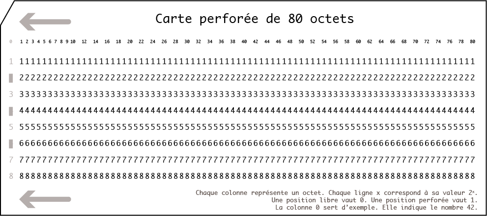

Carte perforée
==============

Une forme de stockage des données 
permanante 
des ordinateurs primitifs 
prenait la forme d'une carte de papier épais 
dans laquelle 
des positions préétablies 
permettaient d'enregistrer 
les valeurs des bits 
sous la forme de trous (pour les valeurs 1) 
ou l'absence de trous (pour les valeurs 0).
Un lecteur 
de cartes perforées 
permettait 
de lire 
relativement rapidement 
(pour l'époque…) 
des données 
en mémoire 
pour les manipuler.

Encoder son prénom en ASCII 
sur l'image de carte perforée.

