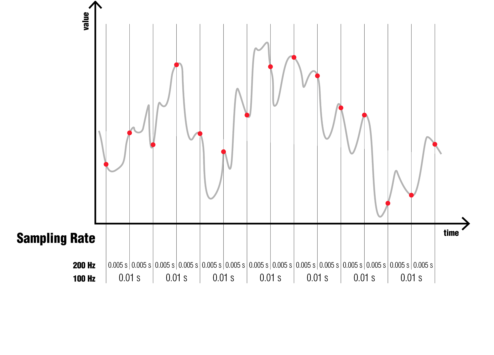
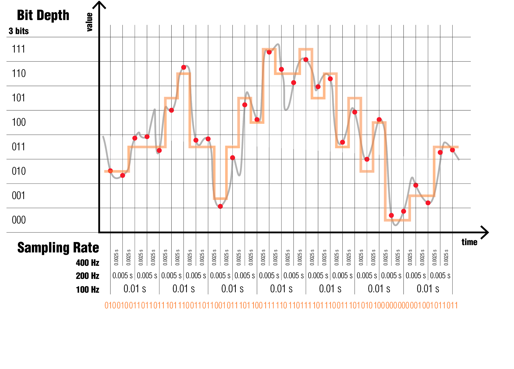
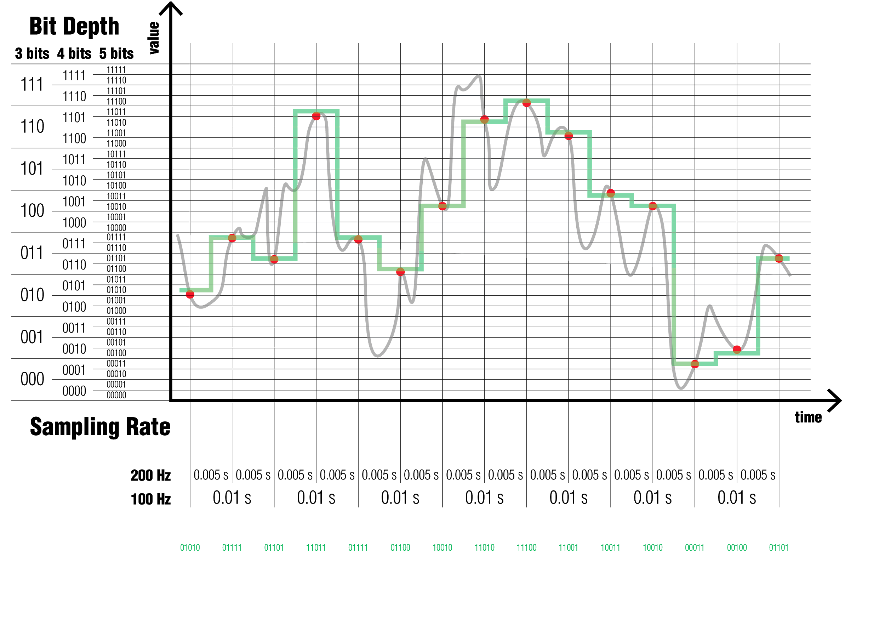
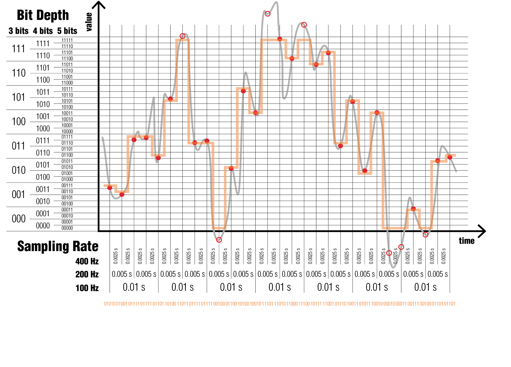
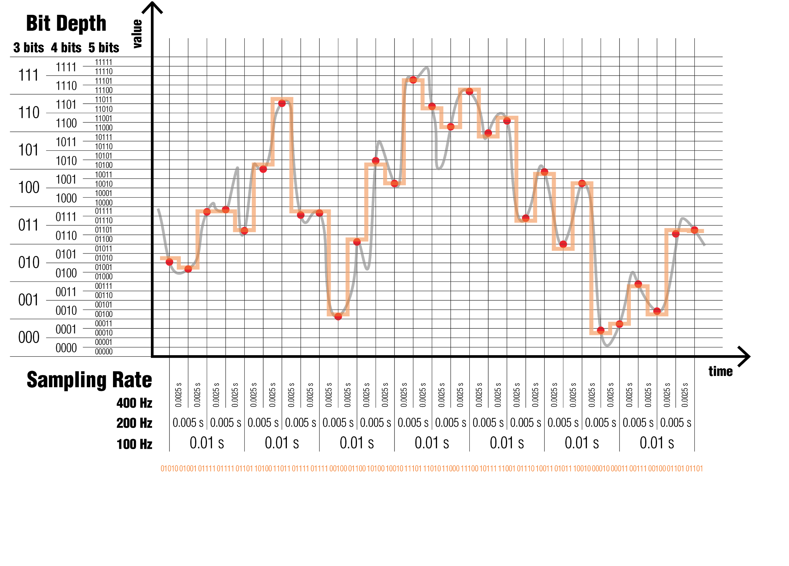
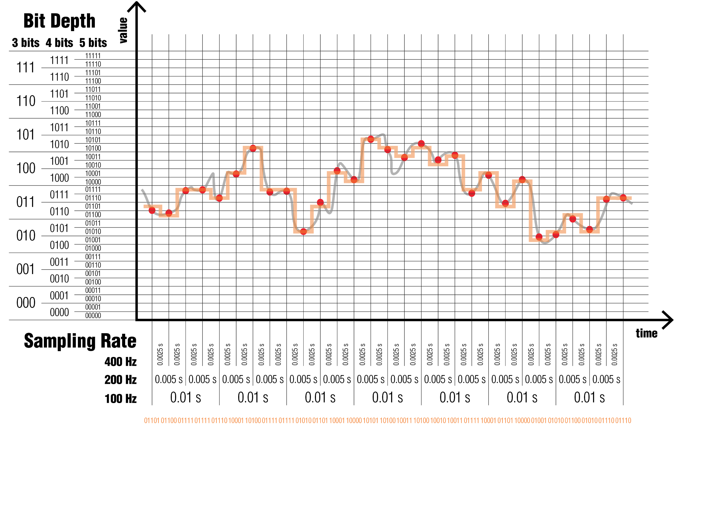

# Représentation des caractères, des images et des sons

## Introduction

## Représentation des caractères

Jeu de caractères ASCII et UTF.

## Codage des couleurs

Images matricielles

## Numérisation

La conversion d’une grandeur physique continue  – intensité sonore, température… – en données numériques manipulables par un ordinateur est appelée numérisation. Elle requiert un échantillonnage et une quantification/encodage.

L’intervalle temporel auquel les mesures sont prises est la fréquence d’échantillonnage (sampling rate).

Les limites pratiques d’un échantillonnage sont fixées par la fréquence de Nyquist, qui, de façon très simplifiée, indique que l’information découlant d’un processus dont la fréquence est deux fois supérieure à celle de l’échantillonnage sera perdue lors de la numérisation.
Sachant que l’oreille humaine perçoit globalement les fréquences entre 20 et 20 kHz, une fréquence d’échantillonnage supérieure à 40 kHz permettra de restituer l’ensemble de l’information physiologiquement perceptible par l’oreille humaine, raison pour laquelle l’échantillonnage de la musique en qualité “CD” est réalisé à 44.1 kHz. Une fréquence d’échantillonnage supérieure ne générerait que plus d’information sans ajouter de valeur qualitative pour la plupart des auditeurs.  

La quantification de la valeur requiert de déterminer la précision (bit depth) de chaque échantillon, ce qui détermine le volume de données générées.

Ici encore, plus on augmente la profondeur de l’encodage, plus la quantité d’information générée augmente, de même que la discrimination du signal, exprimée en amplitude (la différence entre l’intensité la plus faible et la plus élevée).

La distorsion découle d’un signal dont l’amplitude dépasse les capacités d’encodage du système. Dans ces conditions, un ajustement du gain d’entrée est nécessaire pour rester au plus proche des limites du système, sans les franchir. La numérisation d’un signal dont l’amplitude serait par trop réduite débouche sur un encodage qui contient moins d’information.

